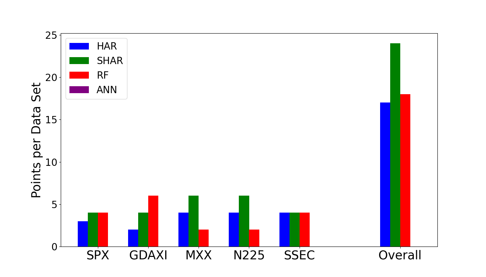

# Volatility Forecasting with Machine Learning Methods

This repository contains the full implementation and results of my first Master's seminar project at the University of Regensburg, at the [Chair of Statistics and Risk Management](https://www.uni-regensburg.de/wirtschaftswissenschaften/bwl-roesch/home/index.html) of Prof. Dr. Daniel Rösch. My seminar paper compared machine learning models with linear benchmarks for **one-day-ahead realized variance forecasting** across multiple international stock indices.


While this was my first exposure to such a modeling task, it was a major personal leap—and I’ve tried to document and structure everything with clarity and the best of my knowledge. For questions and improvement suggestions feel free too [reach out to me](https://de.linkedin.com/in/vincent-heigl-95b620178)!

## Project Scope

The primary goal of this seminar was to evaluate whether machine learning models can outperform traditional volatility models like HAR and SHAR. The models compared include:

* **HAR(3)** – Heterogeneous Autoregressive Model  
* **SHAR(4)** – Semivariance HAR Model  
* **RF** – Random Forest Regressor  
* **ANN** – Artificial Neural Network (Multilayer Perceptron, later extended)

An improved version of the ANN was developed during the project and is available as `main.py`, now featuring **dropout layers** to address overfitting.

---
## Dataset

This project uses the **Oxford-Man Realized Volatility Dataset**, which was kindly provided by my supervisor. Unfortunately, this dataset is currently no longer available from the MAN Institute and cannot be shared or published.

An excerpt from the dataset looks as follows:

```
Date,Symbol,close_price,open_to_close,medrv,rk_th2,bv_ss,rsv_ss,nobs,rv5,rv10,rv10_ss,rk_twoscale,open_time,open_price,rk_parzen,rv5_ss,close_time,rsv,bv
2000-01-03 00:00:00+00:00,.AEX,675.44,-0.0003404608095882722,4.978045931463511e-05,0.00010161900613831257,0.00010042761173061696,4.641401352543891e-05,1795.0,0.00013017016378159244,0.0001778897833256755,0.0001778897833256755,0.00010251694718873555,90101.0,675.67,0.00017899704806649243,0.00013017016378159244,163015.0,4.641401352543891e-05,0.00010042761173061695
2000-01-04 00:00:00+00:00,.AEX,642.25,-0.033605672952653265,7.519469263866767e-05,0.00020050497227363834,0.00020703689373144263,0.0001469018779968006,1785.0,0.00020130565333282923,0.0002605007092433507,0.0002605007092433507,0.0001987200522791225,90416.0,664.2,0.0004225272585042087,0.00020130565333282923,163016.0,0.0001469018779968006,0.00020703689373144263
...
```

For more information about the dataset, see the [CRAN documentation](https://search.r-project.org/CRAN/refmans/bvhar/html/oxfordman.html) and the [Oxford-Man Institute Realized Library](https://oxford-man.ox.ac.uk/research/realized-library/).

Note: The dataset is not included in this repository.
---

## Methodology

**Realized Variance:**

In general form, the arithmetic Brownian Motion $$X_t$$ denotes the stochastic differential equation of the price process of a financial asset s.a. our different indice prices a time $$t$$:

$$
\begin{equation}
dX_t = \mu_t dt + \sigma_t  dW_t,
\end{equation}
$$

The dataset was sampled using log prices. Therfore we simply redefine our price process to a log price process $$ln(S_t) = \{f}(X_t,t) = X_t$$. Where the function $$f$$ depends on an itô process $$X_t$$ and time $$t$$.

Itô's lemma gives:

$$
\begin{equation}
\frac{\partial f}{\partial t} = 0, \quad
\frac{\partial f}{\partial X_t} = 1, \quad
\frac{\partial^2 f}{\partial X_t^2} = 0
\end{equation}
$$

and we obtain 

$$
\begin{equation}
d ln(S_t) = \mu_s \ dt + \sigma \ dW_t \space .
\end{equation}
$$

whereas the solution for $$X_t = ln(S_t)$$ is the integral solution:

$$
\begin{equation}
ln(S_t) = X_t = X_0 + \int_0^t \mu_s \ ds + \int_0^t \sigma_s \ dW_s \space\space with \quad t \geq 0,
\end{equation}
$$

$$X_0$$ is the initial value of the log-price at time $$t = 0$$. $\int_0^t \mu_s \ ds$ is the integral of the drift term $\mu_s$ over the time from 0 to $$t$$. The drift $\mu_s$ represents the deterministic component of the price model and indicates the average change in price over time. $\int_0^t \sigma_s \ dW_s$ is the integral of the volatility component $\sigma_s$ with the stochastic component via a generalized Wiener process $W_s$ for random shocks over the time from 0 to $$t$$.

The goal is to forecast the daily Integrated Variance $IV_t$, defined as:

$$
\begin{equation}
IV_t=\int_{t-1}^{t} \sigma_{s}^{2} \ ds, \quad t = 1, ..., T,
\end{equation}
$$

where $T$ is the total number of days in the sample. In reality, the true Integrated Variance is not directly observable; therefore, an estimator for the discretely sampled measurements of $X_t$ is needed which approximates $IV_t$, originally coined *quadratic variation*.

If the number of observed realized variance $n$ in the time interval $[0,t]$ increases and the time interval between observed prices becomes small ($n \to \infty$), the Realized Variance for one day is defined as:

$$
\begin{equation}
RV_{t}^{(d)} = \sum_{j=1}^n (\Delta_{j}^{n} X)^{2},
\end{equation}
$$

where $\Delta_j^n X = X_{j/n} - X_{(j-1)/n}$ are the $n$ squared log-returns of the $j$-th intraday interval.

Based on the daily Realized Variance $RV_t^{(d)}$, the weekly and monthly realized variances are:

$$
\begin{equation}
RV_t^{(w)} = \frac{1}{5} \left( RV_t^{(d)} + RV_{t-1d}^{(d)} + \cdots + RV_{t-4d}^{(d)} \right),
\end{equation}
$$

$$
\begin{equation}
RV_t^{(m)} = \frac{1}{22} \left( RV_t^{(d)} + RV_{t-1d}^{(d)} + \cdots + RV_{t-21d}^{(d)} \right),
\end{equation}
$$

The moving average for five and 22 trading days is computed for the weekly $RV_t^{(w)}$ and the monthly $RV_t^{(m)}$ respectively.

## Modeling Realized Volatility

**Heterogeneous Autoregressive Model (HAR):**

The HAR model will be the benchmark for the following realized variance model forecasting comparison.  
It is the default benchmark in the literature in its simplest configuration.  There are many modifications of the original HAR model such as the HAR-BV with Bipower variation, the HARQ and the HExp model from Bollerslev et al. (2018).

For this seminar paper, the original model configuration of Fulvio Corsi (2009) with three lags for daily, weekly, and monthly $RV$ is taken.  
The HAR model is defined as:

$$
\begin{equation}
RV_t^{(d)} = \beta_{0} + \beta_{d}RV_{t-1}^{(d)} + \beta_{w}RV_{t-1}^{(w)} + \beta_{m}RV_{t-1}^{(m)} + u_t,
\end{equation}
$$

where $\beta_0$ is the intercept, $\beta_d$ the daily, $\beta_w$ the weekly, and $\beta_m$ the monthly coefficient for the respective lags with an error term $u_t$.

To enable an even better comparison between non-linear and linear models, more explanatory variables must be included.  
Kim Christensen (2021) provided a solution with the HAR-X model. This paper limits itself to a fixed set of explanatory variables for a fair benchmark comparison.

**Semivariance Heterogeneous Autoregressive Model (SHAR):**

This paper uses the simple SHAR model by Patton and Sheppard (2015) as the second linear benchmark.  
Only the daily $RV_t^{(d)}$ is decomposed into its semivariance jump components:

$$
\begin{equation}
RS_{t-1}^{(d)+} = \sum_{j=1}^{n} (\Delta_{j}^{n} X)^{2} I\{\Delta_{j}^{n} X > 0\},
\end{equation}
$$

$$
\begin{equation}
RS_{t-1}^{(d)-} = \sum_{j=1}^{n} (\Delta_{j}^{n} X)^{2} I\{\Delta_{j}^{n} X < 0\},
\end{equation}
$$

The positive realized semivariance $RS_{t-1}^{(d)+}$ sums all positive jumps and $RS_{t-1}^{(d)-}$ the negative ones.  
According to Patton and Sheppard, the sign contains information about tomorrow’s volatility.

Daily decomposed semivariance:

$$
\begin{equation}
RV_t^{(d)} = RS_{t}^{(d)+} + RS_{t}^{(d)-},
\end{equation}
$$

Substituting into the model gives the SHAR equation:

$$
\begin{equation}
RV_t^{(d)} = \beta_{0} + \beta_{+}RS_{t-1}^{(d)+} + \beta_{-}RS_{t-1}^{(d)-} + \beta_{w}RV_{t-1}^{(w)} + \beta_{m}RV_{t-1}^{(m)} + u_t,
\end{equation}
$$

Patton and Sheppard showed that negative returns significantly increase forecasted volatility, while positive returns do not.

For comparability with machine learning methods, we define a general HAR-X form:

$$
\begin{equation}
RV_t^{(d)} = \beta_{0} + \beta_{Z}'Z_{t-1} + u_t,
\end{equation}
$$

Where:

$$
\begin{equation}
\beta_Z = (\beta_{+}, \beta_{-}, \beta_d, \beta_w, \beta_m)
\end{equation}
$$

$$
\begin{equation}
Z_{t-1} = (RS_{t-1}^{(d)+}, RS_{t-1}^{(d)-}, RV_{t-1}^{(d)}, RV_{t-1}^{(w)}, RV_{t-1}^{(m)})
\end{equation}
$$

To obtain the coefficients, a least squares approach is used with:

$$
\begin{equation}
f(Z_{t-1}, \beta_Z) = \beta_Z' Z_{t-1}
\end{equation}
$$

**ANN Architecture:**

$$
\begin{equation}
\hat{f}(Z_{t}) = g_L \left( \sum_{j=1}^{N_L} \theta_{ij}^{(L)} \space a_{j,L}^{(t)} + b_{i}^{(L)} \right)
\end{equation}
$$

This equation shows the forward pass in a fully connected feedforward ANN, where each neuron’s output depends on a weighted sum of the inputs, a bias term, and a non-linear activation function $$g_L$$. The ANN learns the function $$f(Z_t)$$ by adjusting weights $\theta$ and biases $$b$$ to minimize the prediction error. The input $$Z_t$$ propagates recursively through earlier layers to produce the activations $$\(a_{j,L}^{(t)}\)$$. The final output is passed through a linear activation function.

**RF Aggregation:**

$$
\begin{equation}
\hat{f}(Z_t) = \frac{1}{B} \sum_{b=1}^{B} \hat{f}^{b}(Z_{t-1}^{b}, \Theta^{b})
\end{equation}
$$

Here, the forecast is the average across $B$ regression trees. Each $\hat{f}^{b}$ represents an independently trained decision tree using a bootstrapped dataset and random feature subset (feature bagging), and $\Theta^b$ denotes the deterministic vector of parameters chosen for each tree out of a given fixed hyperparameter grid. This averaging reduces variance and improves generalization.


---

## Experimental Setup

* **Data:** Oxford-Man Realized Volatility Dataset (unfortunately not publicly shareable)  
* **Indices:** SPX, GDAXI, MXX, N225, SSEC  
* **Windowing:** Fixed training/validation/test split: 80/10/10  
* **Hyperparameter tuning:** Grid search for ANN and RF  

**Random Forest (RF):**

In the initial version (`v16_HAR_20240611.py`), Random Forest hyperparameters were tuned using a simple fixed grid:
- `n_estimators`: [500]
- `max_features`: [1, "sqrt", "log2"]
- `max_depth`: [5, 10, 20]

This grid was chosen to balance computational cost and model flexibility, focusing on the number of features considered at each split and tree depth. However, it was relatively narrow and did not explore other important parameters such as minimum samples per split or leaf, nor did it test a broader range of tree counts.

**In the improved version (`main.py`),** the hyperparameter grid was expanded and refined to include:
- A wider range of `n_estimators` (number of trees)
- More granular `max_depth` values
- Additional parameters like `min_samples_split` and `min_samples_leaf`
- Different `max_features` strategies

This broader grid allows for a more thorough search, improving the model's ability to generalize and reducing the risk of overfitting or underfitting. The changes were motivated by the need for more robust model selection and better pseudo out-of-sample performance.

---

**Artificial Neural Network (ANN):**

The original ANN tuning in `v16_HAR_20240611.py` used the `MLPRegressor` with a small fixed grid:
- `hidden_layer_sizes`: [(5, 2), (5,)]
- `activation`: ["relu"]
- `solver`: ["adam"]
- `learning_rate`: ["constant", "adaptive"]

This setup provided a basic exploration of network depth and learning rate adaptation, but was limited in terms of network complexity and regularization.

**In `main.py`,** the ANN was re-implemented using Keras, allowing for:
- Flexible architecture design (more layers, more neurons)
- Dropout layers for regularization (to combat overfitting)
- A wider hyperparameter grid, including dropout rates, batch size, learning rate, and optimizer choice

This transition to Keras and the expanded grid enabled more expressive models and better control over training dynamics, resulting in improved pseudo out-of-sample performance.

---

* **Performance metrics:**
  * MSE (Mean Squared Error)
  * QLIKE (Quasi-Likelihood)
  * R² (Coefficient of Determination)

---

## Codebase Structure

* `v16_HAR_20240611.py`: Modular version with separate ANN and RF implementations  
* `main.py`: Refactored and improved version featuring:
  * Keras ANN with dropout layers  
  * Integrated validation & testing  
  * Loading and saving of best models  
  * Reproducible configuration with seeds and modular structure

> Lesson learned: While having all models in one file looks "handy", in practice it leads to clutter. This project helped me understand the value of proper separation, reusability, and parameter configuration via YAML or dictionaries.

---

## Selected Results

Across all metrics, the **SHAR model** showed the best performance in 3 of 5 indices. The **Random Forest** consistently outperformed the initial ANN model and came close to SHAR in some configurations.

### Metric Comparison

In this comparison the metrics MSE and QLIKE are equally weighted in terms of importance. Based on the collected results each model gets a score of points per data set per metric. The score is calculated by assigning three points for the best, two for the second best, one for the third and zero for the worst performance.



---

## Architecture Summary

The project followed the HAR-X framework to generalize the feature space and model evaluation. Here's a simplified architecture flow:

1. **Preprocessing:**
   * Compute daily, weekly, and monthly realized variance  
   * Decompose semivariance  
2. **Model Training:**
   * HAR, SHAR (linear OLS)  
   * RF (sklearn, grid tuned)  
   * ANN (Keras/Tensorflow, grid tuned)  
3. **Evaluation:**
   * Metric outputs per index  
   * Visualization of predictions

---

## Reflections

This seminar was a challenging but rewarding introduction to empirical financial modeling. It taught me:

* The value of regularization (e.g., dropout)  
* The practicality of a config file for managing assumptions  
* The need to modularize experiments for future extensions  
* The importance of cross-sectional robustness (e.g., testing multiple indices with heterogeneous patterns)

The extended script now allows switching between indices (via `symbol`) to investigate hypothesis robustness across markets.

---ö

## Future Work & Related Fields

I'm currently writing my **Master’s thesis** on **CNN-based forecasting of implied volatility surfaces**, building on many of the techniques and learnings from this seminar. Key areas of future exploration:

* CNN and RNN model architectures for IV surfaces  
* Image-like input data and implied volatility grid encoding  
* Hybrid models combining traditional finance features with deep learning  
* Exploration of **quantum causal models** and novel ways to **combine linear interpretability with nonlinear power**

Relevant fields include:

* Financial Econometrics  
* Forecasting and Risk Modeling  
* Machine Learning for Asset Pricing  
* Volatility Surface Modeling

---

## Files Overview

| File                  | Description                                                      |
| --------------------- | ---------------------------------------------------------------- |
| `main.py`             | Improved version with dropout, Keras ANN, and modular validation |
| `v16_HAR_20240611.py` | Original baseline with RF and ANN tuning logic                   |
| `README.md`           | You're reading it!                                               |

---

## Acknowledgments

This project was submitted as part of the Master's seminar at the Chair of Statistics and Risk Management, University of Regensburg. I thank my advisor and the department for their support and for encouraging exploration beyond traditional econometrics.

---

*This repository is meant as a reference, personal milestone, and potential base for anyone exploring volatility modeling with both traditional and machine learning methods. If you find something worth building on, [feel free to reach out](https://de.linkedin.com/in/vincent-heigl-95b620178).*

---


